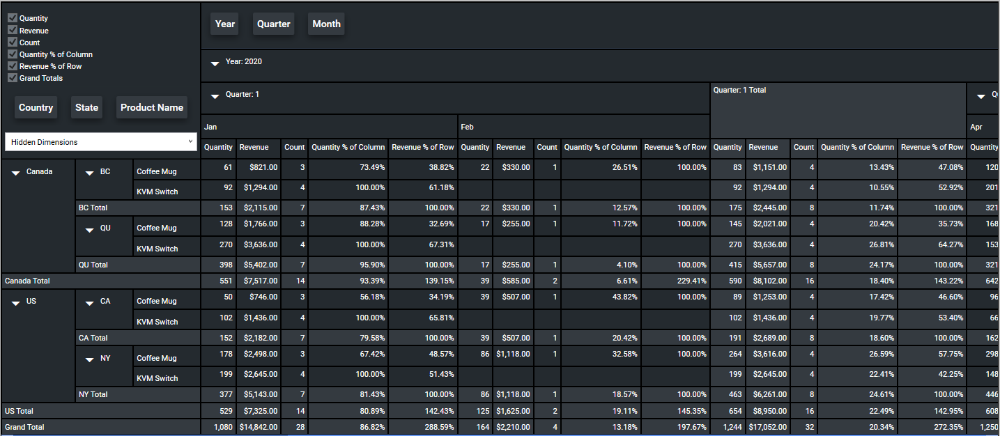

# LeaderPivot.XAML.WPF

A pivot table control for WPF.

* Easy to implement and configure
* Drag and drop dimensions across axis
* User configurable measures
* Four color themes provided, customize or create your own.

 

# Getting Started

* Clone this repository and run the demo application.  This repository contains source code for the control as well as a small demo application.

* [Get the test data application](https://github.com/leaderanalytics/LeaderPivot.TestData)

* [Get the NuGet package](https://www.nuget.org/packages/LeaderAnalytics.LeaderPivot.XXX/)

* Create a data structure to model your denormalized data.  See the [`SalesData`](https://github.com/leaderanalytics/LeaderPivot.TestData/blob/main/LeaderPivot.TestData/SalesData.cs) class for an example.

* Create [Dimensions](https://github.com/leaderanalytics/LeaderPivot/blob/main/LeaderPivot/Dimension.cs) and [Measures](https://github.com/leaderanalytics/LeaderPivot/blob/main/LeaderPivot/Measure.cs).    Dimensions are used to group data.  Measures are used to create the values shown in each cell of the pivot table.  Examples are provided in the [TestData](https://github.com/leaderanalytics/LeaderPivot.TestData/blob/main/LeaderPivot.TestData/SalesData.cs) project.

* Add a [LeaderPivot control](https://github.com/leaderanalytics/LeaderPivot.XAML.WPF/blob/main/LeaderPivot.XAML.WPF.Host/MainWindow.xaml) to your page.  

This control is based on [LeaderPivot](https://github.com/leaderanalytics/LeaderPivot).

An implementation for Blazor can be found [here](https://github.com/leaderanalytics/LeaderPivot.Blazor).

